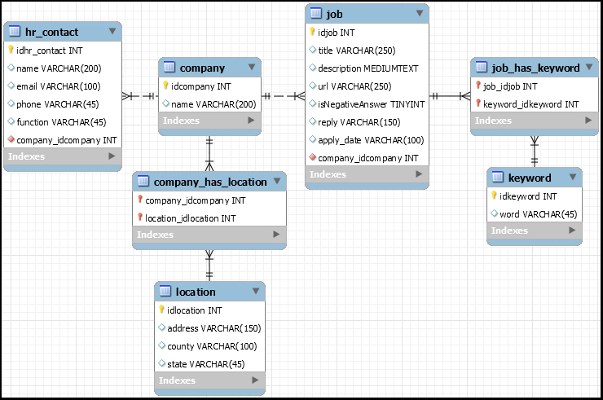
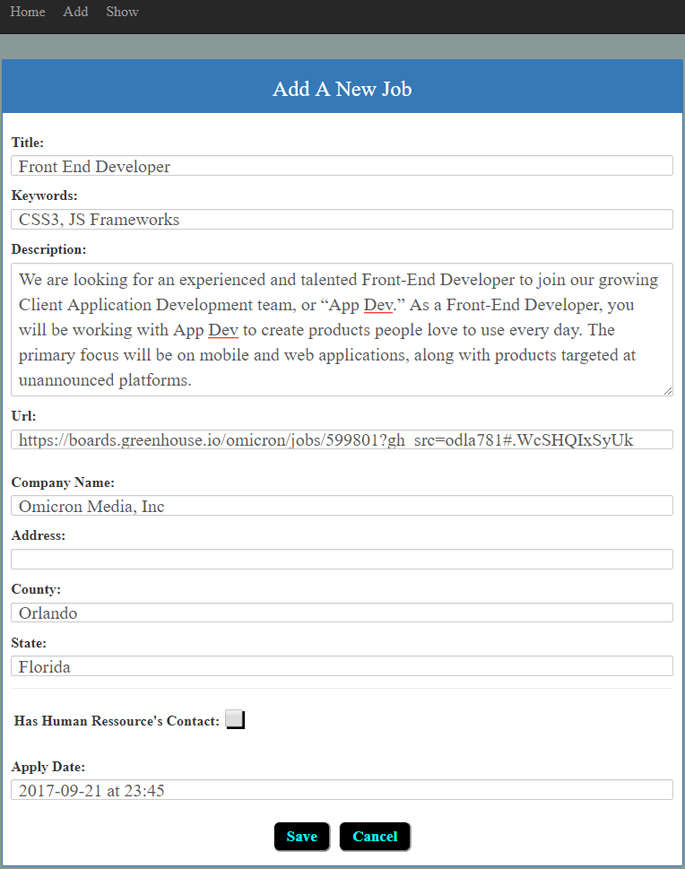
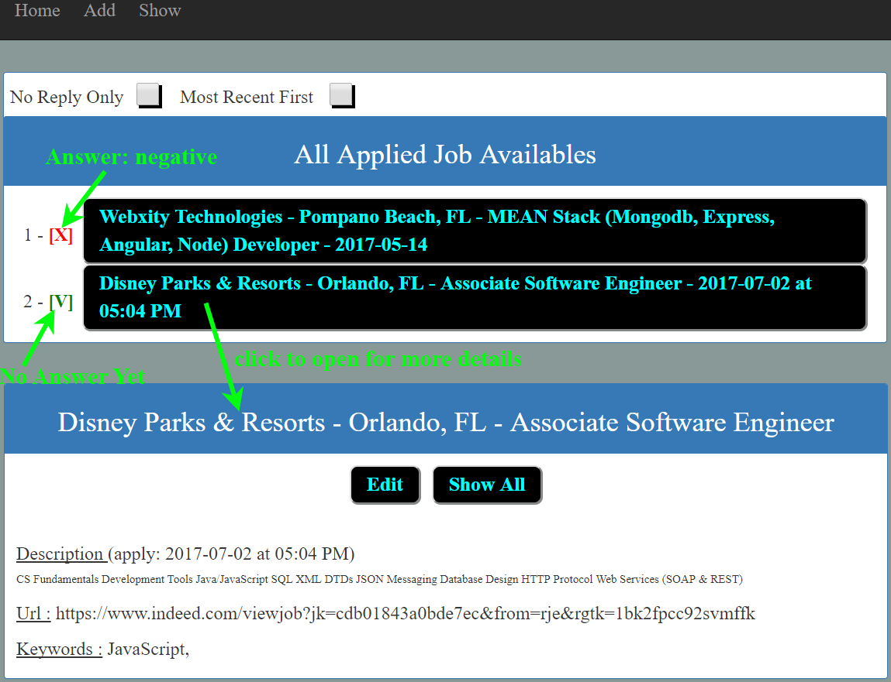

# Job Search Organizer: MySQL and Angular 2 (Project's done within 2 days)

## Goal

> While looking for a job, it's cool to have a tool to help to organize everything. We could be able to choose by "**date**", "**town**", "**category**" (per example, "**front-end developer**", "**angular**", etc.), by "**company name**", etc. We could select only companies that not reply (still have hope) and hide companies that sent a negative answer.

## The EER (enhanced entity-relationship)

## User Interface

### Add New Job's Offer

### Show Job(s)

## Execution(development's mode)

> 1. **SQL database**: execute the [model](server/sql_model/sql_model.sql) (create **database** and/or **tables** and/or **procedures** if not existed)
> 2. Set up the configuration to get access to YOUR Database ([here](server/config/connection.js)). In this case, you must enter YOUR password (to your database)
> 3. In a terminal, execute "**npm run build**"
> 4. Open an Internet Browser, enter "**localhost:3000**"

## Important Files ...
> * Create database, set it in "Use", create tables ([here](server/sql_model/sql_model.sql))
> * All request to database server (MySQL) could be see ([here](server/routes/api-routes.js))

## Author
* Dinh HUYNH - All Rights Reserved!
* dinh.hu19@yahoo.com
